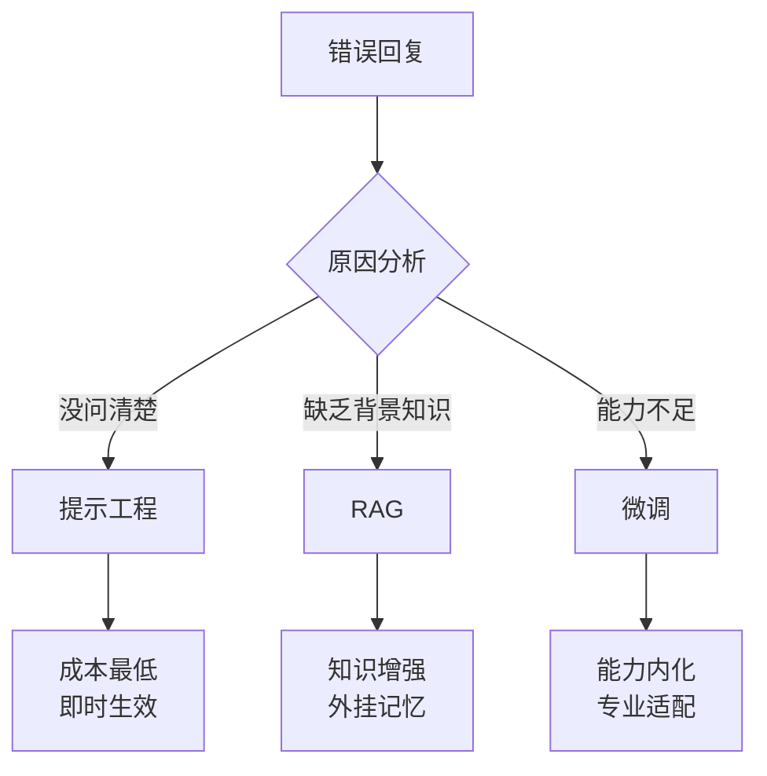
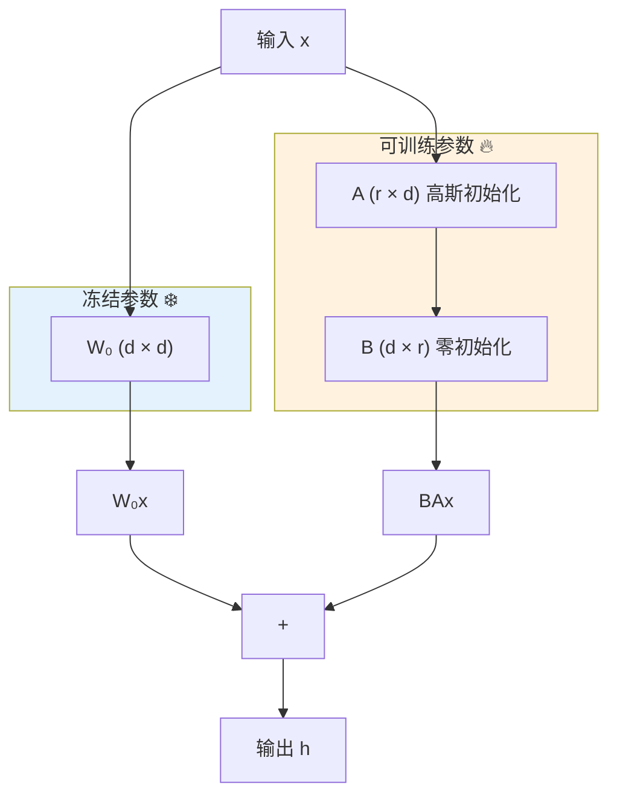
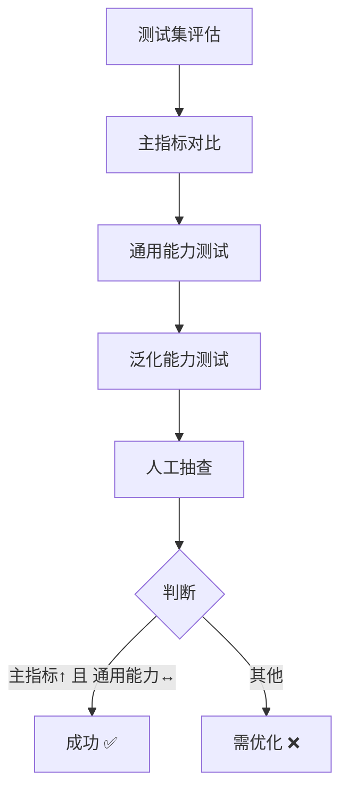
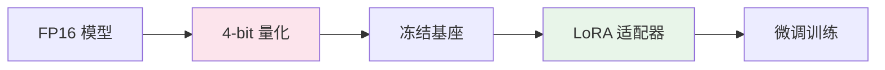
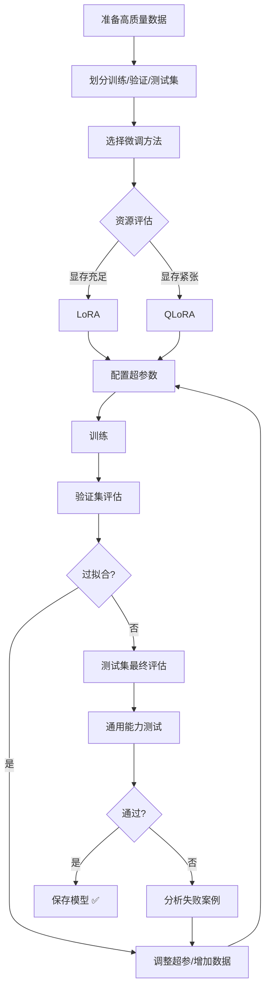

# LLM 微调原理笔记

> 基于课件 + 个人思考 | 大镯子的学习笔记

---

## 1. 什么时候用什么方法？



**思考**: 基座模型公司（OpenAI、DeepSeek、月之暗面）做的是**通用能力微调**，数据规模大（万亿 token）、成本高（千卡月级）；应用开发者做的是**垂直领域微调**，数据量小（1k-1M 条）、成本低（数小时～数天）。

---

## 2. 高效微调方法对比

| 方法 | 可训练参数 | 核心思想 | 适用场景 |
|------|------------|----------|----------|
| **Prompt Tuning** | <0.01% | 冻结模型，只在输入层添加可训练的"软提示"向量 | 模型规模很大(>10B)时效果才好 |
| **P-Tuning v2** | 0.1%~1% | 升级版，软提示插入每一层，效果更强 | NLU任务，中小模型也能用 |
| **Prefix Tuning** | 0.1%~3% | 每层头部添加可训练前缀向量，通过 MLP 生成 | NLG任务（对话、摘要、翻译） |
| **LoRA** | 1%~10% | 低秩分解，用两个小矩阵近似权重更新 | **最通用**，LLM 和扩散模型都适用 |
| **QLoRA** | 1%~10% | 先4-bit量化，再LoRA微调 | 资源受限，想微调大模型 |

---

## 3. LoRA 原理详解 ⭐

### 3.1 核心假设

**低秩特性**: 权重更新矩阵 ΔW 虽然形式上很大，但有效信息集中在前几个奇异值方向上。

> 比喻：一个 1000×1000 的表格，如果每行都是第一行的倍数，你只需要保存很少的基础数据就能重建整个表格。

**数学体现**: 对 ΔW 做 SVD 分解，奇异值衰减极快，绝大部分接近零。

### 3.2 前向传播

```
h = Wx + BAx = (W + BA)x
```

- **W**: 冻结的预训练权重 (d × d)
- **A**: 降维矩阵 (r × d)，高斯初始化
- **B**: 升维矩阵 (d × r)，**初始化为 0**
- **r**: 秩（通常 4-64）



### 3.3 为什么 B 初始化为 0？

训练开始时 BA = 0，模型输出等于原始预训练模型输出，避免破坏预训练知识。

### 3.4 秩的选择

- 一般任务: rank = 1, 2, 4, 8 即可
- 复杂任务: 可选更大的 rank

### 3.5 多任务切换

```
当前任务: h = Wx + B₁A₁x
切换任务: h = Wx + B₂A₂x
```

只需替换 LoRA 权重，无需重新加载模型。

---

## 4. 矩阵分解与 SVD

### 4.1 推荐系统的矩阵分解

**问题**: 预测用户对未看过电影的评分

```
评分矩阵 R (用户×电影) = User矩阵 × Item矩阵ᵀ
```

**目标函数**:
```
min Σ (rᵤᵢ - xᵤᵀyᵢ)² + λ(||xᵤ||² + ||yᵢ||²)
```

- **xᵤ**: 用户 u 的隐向量
- **yᵢ**: 电影 i 的隐向量
- **rᵤᵢ**: 实际评分

**求解方法**:
- **ALS**: 交替固定 User/Item 矩阵，最小二乘求解
- **SGD**: 随机梯度下降

### 4.2 SVD 奇异值分解

```
A = P Λ Qᵀ
```

- **P**: 左奇异矩阵 (User 矩阵)
- **Q**: 右奇异矩阵 (Item 矩阵)
- **Λ**: 对角矩阵，奇异值 λ₁ ≥ λ₂ ≥ ... ≥ λₖ

**关键洞察**: 少量特征值（如 10%）可还原大部分信息（如 99%）

```python
# Python SVD 示例
from scipy.linalg import svd
p, s, q = svd(A, full_matrices=False)
# 只保留前 k 个奇异值
s_temp = np.zeros(s.shape[0])
s_temp[0:k] = s[0:k]
```

### 4.3 LoRA 与矩阵分解的联系

LoRA 本质上就是用低秩分解 (BA) 来近似权重更新 ΔW，与推荐系统中的矩阵分解思想一致。

---

## 5. 微调数据准备

### 5.1 数据质量要求

| 维度 | 要求 | 说明 |
|------|------|------|
| **一致性** | 格式、风格统一 | 所有数据遵循相同模板 |
| **准确性** | 答案正确 | Garbage in, garbage out |
| **多样性** | 覆盖各种情况 | 提高泛化能力 |

**数据模板示例**:
```xml
<指令>{instruction}</指令>
<输入>{input}</输入>
<回复>{response}</回复>
```

### 5.2 数据量建议

| 模型规模 | 任务复杂度 | 建议数据量 |
|----------|------------|------------|
| ~7B | 简单任务（风格模仿、简单问答） | 1,000 - 5,000 条 |
| ~7B | 复杂任务（推理、专业领域） | 5,000 - 50,000+ 条 |
| 13B~70B | 通用/复杂任务 | 1万 - 10万+ 条 |
| >70B | 继续预训练 | 海量数据 (GB 级别) |

**黄金法则**: 1000-6000 条高质量数据已经可以产生很好的微调效果。

### 5.3 数据准备步骤

1. **聚焦质量**: 花 80% 时间在数据清洗、格式统一、答案校验
2. **评估数量**: 从小规模开始（如 1000 条），实验后决定是否增加
3. **任务越复杂，数据越多**

---

## 6. 硬件需求与显存计算

### 6.1 显存组成

```
总显存 = 模型权重 + 优化器状态 + 梯度 + 激活值
```

| 组成部分 | 计算公式 | LoRA 优化 |
|----------|----------|-----------|
| **模型权重** | 参数量 × 2字节 (FP16) | 不变 |
| **优化器状态** | L × 8字节 (AdamW 两状态) | L 很小，几乎忽略 |
| **梯度** | L × 2字节 | L 很小，几乎忽略 |
| **激活值** | 权重显存 × 20%~50% | 与 batch size 相关 |

### 6.2 实际估算：7B 模型

假设 LoRA 可训练参数 L = 1% × 7B = 70M

| 项目 | 计算 | 显存 |
|------|------|------|
| 模型权重 | 7e9 × 2字节 | ~14 GB |
| 优化器状态 | 7e7 × 8字节 | ~0.56 GB |
| 梯度 | 7e7 × 2字节 | ~0.14 GB |
| 激活值 | 14GB × 30% | ~4.2 GB |
| **总计** | | **~19 GB** |

**结论**: 一张 24GB 显存的 RTX 4090 足够微调 7B 模型。

### 6.3 硬件选择建议

| 模型规模 | 显存需求 | 推荐显卡 |
|----------|----------|----------|
| 7B/8B | ~20GB | RTX 3090/4090 (24GB) |
| 13B/14B | ~30GB | RTX 5090 (32GB) 或 QLoRA |
| 70B | ~140GB+ | 多卡 + QLoRA 必需 |

### 6.4 QLoRA 的魔力

```
QLoRA: FP16 → 4-bit 量化
模型权重显存: 参数量 × 0.5 字节
```

微调 7B 模型仅需 **6-8GB 显存**，让消费级显卡都能参与。

---

## 7. 微调后的模型评估

### 7.1 数据集划分

| 数据集 | 用途 | 关键点 |
|--------|------|--------|
| **训练集** | 更新权重 | 喂给 LoRA 微调 |
| **验证集** | 监控训练、调整超参 | 不能用于最终报告 |
| **测试集** | 最终性能评估 | 必须严格"封存" |

> ⚠️ 测试集是模型的期末考试，绝对不能提前泄露考题！

### 7.2 评估维度

| 维度 | 内容 | 说明 |
|------|------|------|
| **任务主指标** | 分类: 准确率/F1<br/>生成: BLEU/ROUGE<br/>问答: EM/F1 | 硬性标准 |
| **通用能力保持** | 常识推理、代码能力、通用对话 | 防止灾难性遗忘 |
| **泛化能力** | 不同表述、复杂场景 | 检验是否死记硬背 |
| **人工评估** | 流畅度、相关性、有用性 | 黄金标准 |
| **输出质量分析** | 正面/失败案例分析 | 直观理解模型行为 |

### 7.3 评估流程



---

## 8. QLoRA 技术细节



**三大关键技术**:
1. **NF4 量化**: 正态浮点 4-bit，信息损失最小
2. **双重量化**: 量化常数也量化，再省 0.5-bit
3. **分页优化器**: GPU 内存不足时用 CPU 内存

---

## 9. 关键超参数

| 参数 | 推荐值 | 说明 |
|------|--------|------|
| **rank (r)** | 8-64 | 越大能力越强，边际递减 |
| **alpha** | 2×rank | 缩放因子，通常 alpha = 2r |
| **learning_rate** | 1e-4 ~ 5e-4 | LoRA 可用较大 lr |
| **target_modules** | q,v 或 all | 投影层效果最好 |
| **dropout** | 0.05-0.1 | 防止过拟合 |

---

## 10. 最佳实践

### ✅ 推荐做法

- 先小规模实验，确认流程正确
- rank 从小开始，逐步增大
- 学习率预热 + 余弦衰减
- 使用 gradient checkpointing 省显存
- 监控 loss 曲线，防止灾难性遗忘

### ❌ 避免踩坑

- 数据质量差不如不微调
- 不要盲目增大 rank
- 避免学习率过大导致崩溃
- 不要忽略验证集评估
- 训练集太小（20-30 samples）会把大模型带跑

---

## 11. 思考与总结

### 我的理解

1. **微调的本质**: 在预训练模型的"知识地基"上盖"专业建筑"，而不是重建地基。微调是"激发"已有能力，而非灌输新知识。

2. **LoRA 之美**:
   - 用数学直觉（低秩假设）解决工程问题
   - 将"改什么"和"怎么改"解耦
   - 让大模型微调从"贵族游戏"变成"平民运动"

3. **关键认知**:
   - **数据质量 > 数据数量**，100条高质量 > 10000条噪音
   - 方法选择看资源，不是越复杂越好
   - 微调是手段，不是目的

4. **LoRA vs 全量微调**:
   - 如果训练集很小（20-30 samples），全量微调会把大模型带跑
   - LoRA 因为参数少，反而更稳定，不容易过拟合

---

## 12. 训练流程图



---

> 📌 **记住**: 微调是给模型"学专业"，不是"重学说话"。保护好预训练的知识，只教新技能。
