# Embedding 与向量数据库学习笔记

## 一、什么是 Embedding？

**Embedding** 是一种将离散对象（如词、句子、图像等）映射为**低维、稠密向量**的技术，目的是捕捉语义信息，使得语义相近的对象在向量空间中距离更近。

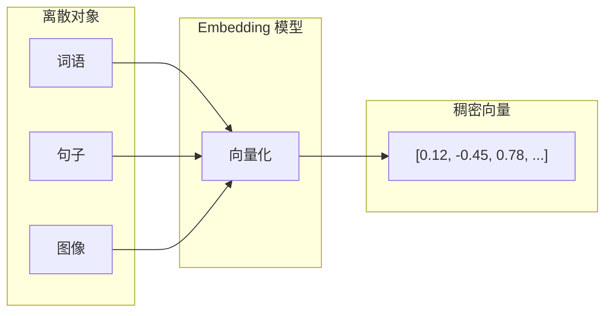

### 核心特性

| 特性 | 说明 | 示例 |
|:---:|:---|:---|
| **固定维度** | 所有对象映射为相同长度的向量 | 768 维、1024 维 |
| **语义相似度** | 通过余弦相似度等度量计算相似性 | `cos(v₁, v₂) → [0, 1]` |
| **向量运算** | 支持语义层面的数学运算 | `king - man + woman ≈ queen` |

---

## 二、传统文本特征表示方法

### 1. N-Gram

基于"第 n 个词与前 n−1 个词相关"的假设，用于扩展特征，提升模型对局部上下文的感知能力。

| 类型 | 名称 | 示例（原句：我爱学习） |
|:---:|:---:|:---|
| 1-gram | Unigram | `[我, 爱, 学, 习]` |
| 2-gram | Bigram | `[我爱, 爱学, 学习]` |
| 3-gram | Trigram | `[我爱学, 爱学习]` |

### 2. TF-IDF

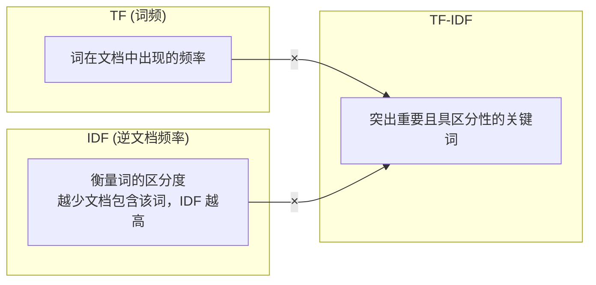

> [!WARNING]
> **缺点**：N-Gram + TF-IDF 生成的特征矩阵**极度稀疏**，计算开销大。

---

## 三、Word Embedding 技术

### 1. Word2Vec

将词映射到连续向量空间，语义相近的词距离更近，输出为一个"查找表"（Lookup Table）。

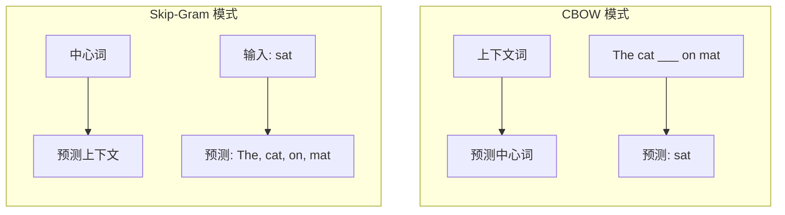

| 模式 | 输入 | 输出 | 适用场景 |
|:---:|:---:|:---:|:---|
| **Skip-Gram** | 中心词 | 上下文词 | 低频词效果更好 |
| **CBOW** | 上下文词 | 中心词 | 训练速度更快 |

### 2. 工具支持

- **Gensim**：支持 Word2Vec、FastText、Doc2Vec 等
- 可用于训练自定义语料（如《西游记》《三国演义》），进行词相似度或类比推理

---

## 四、如何选择合适的 Embedding 模型？

### 1. MTEB 榜单

**MTEB（Massive Text Embedding Benchmark）** 包含 **8 大任务类型**、**58 个数据集**，全面评估模型性能：

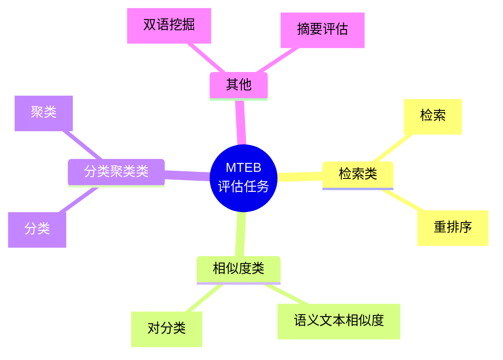

> [!TIP]
> 根据具体任务（如检索 or 分类）筛选候选模型。

### 2. 向量维度的影响

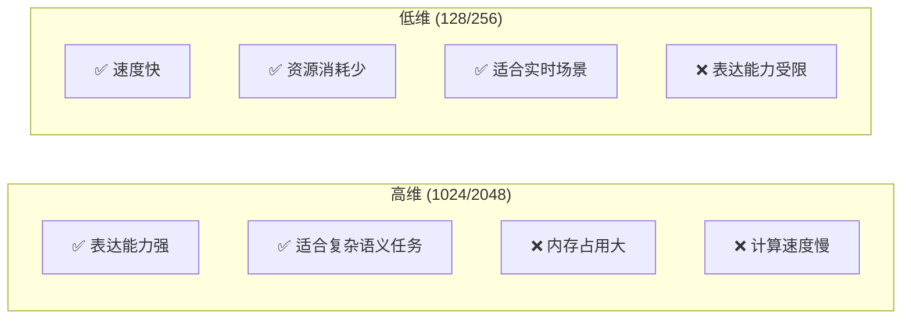

> [!IMPORTANT]
> **选择原则**：若升维带来的性能提升 < 1%，但内存增加 > 30%，则**不值得**。

### 3. "俄罗斯套娃"技术（MRL）

**Matryoshka Representation Learning** 允许模型内部生成完整高维向量，可按需截取前 N 维，仍保持高质量。

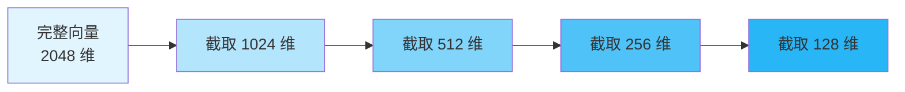

### 4. 单语言 vs 多语言模型

| 类型 | 代表模型 | 特点 | 适用场景 |
|:---:|:---|:---|:---|
| **单语言模型** | BGE-large-zh | 针对特定语言优化，理解更深 | 中文客服问答、电商 FAQ 匹配 |
| **多语言模型** | m3e-base, multilingual-E5 | 多语言统一语义空间 | 跨语言评论分析、国际酒店评价 |

> [!NOTE]
> 跨语言检索依赖：不同语言表达相同语义时，向量应接近（如 `"clean room" ≈ "干净的房间"`）

### 5. 模型选型流程

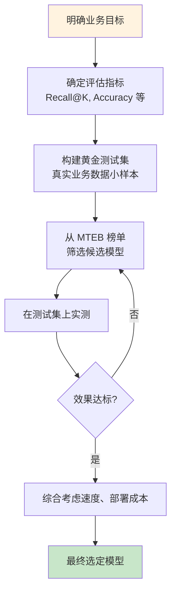

---

## 五、什么是向量数据库？

向量数据库是专门用于存储和高效检索**高维向量**的数据库，核心能力是**相似性搜索**。

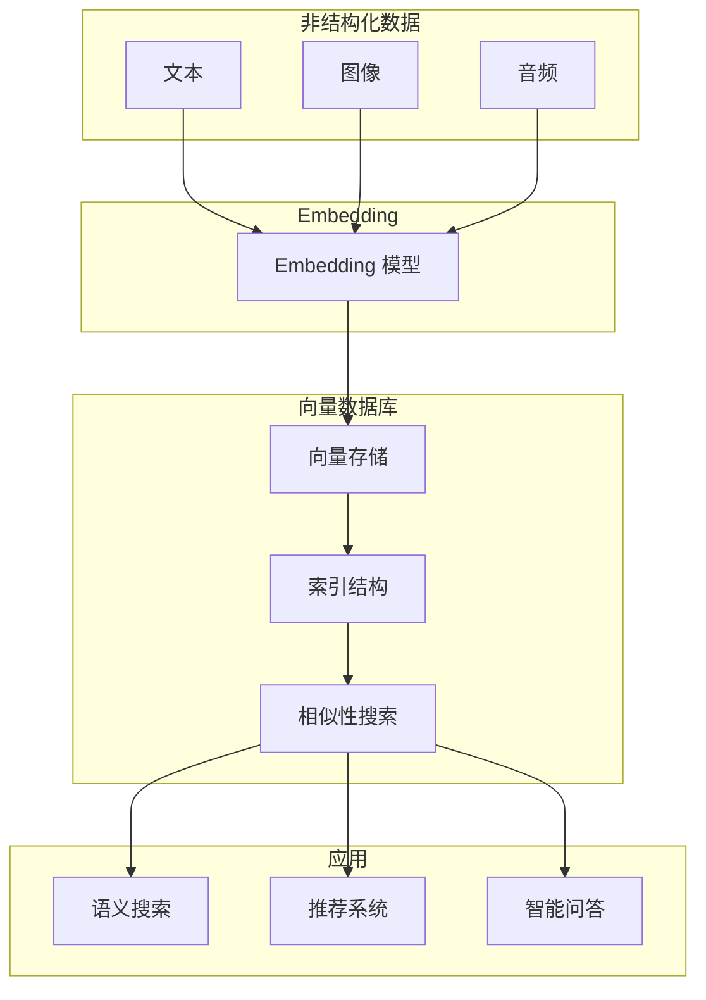

### 核心价值

| 价值 | 说明 |
|:---:|:---|
| 🧠 **长期记忆** | 为大模型提供外部记忆，突破上下文窗口限制 |
| 📚 **私有知识库** | 实现企业私有知识库问答 |
| 🎯 **智能应用** | 支撑推荐系统、以图搜图、语义搜索等 AI 应用 |

---

## 六、主流向量数据库对比

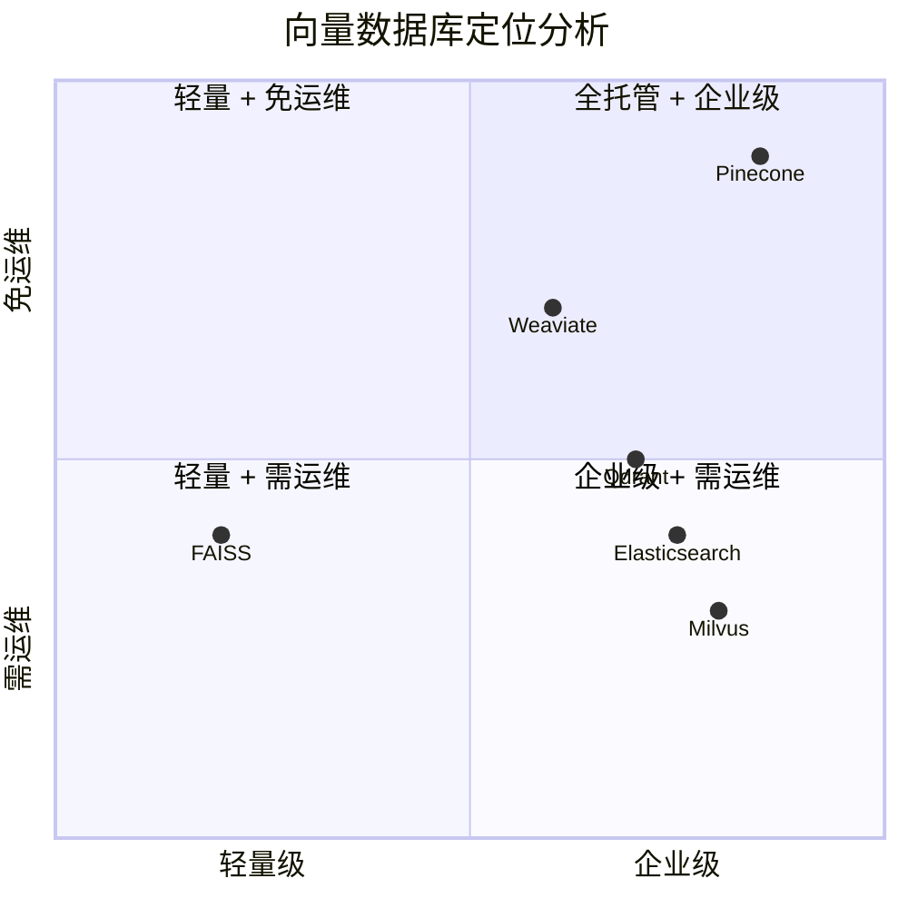

| 数据库 | 特点 | 性能 | 适用场景 |
|:---:|:---|:---|:---|
| **FAISS** | Meta 开发，算法库（非完整 DB），支持 CPU/GPU | ⚡ 极快（内存内裸向量检索） | 算法研究、需深度集成的系统 |
| **Milvus** | 开源、云原生、高扩展 | 📈 大规模数据下表现优异 | 企业级应用，需私有部署 |
| **Pinecone** | 全托管 Serverless，API 简洁 | ⏱️ 低延迟，性能稳定 | 快速上线、免运维团队 |
| **Weaviate** | 内置自动向量化，支持多种模型 | 🛠️ 易用性强 | 快速构建端到端检索链路 |
| **Qdrant** | Rust 编写，内存安全，过滤能力强 | 🔍 混合查询性能突出 | 金融、电商等复杂过滤场景 |
| **Elasticsearch** | 通用搜索引擎，新增 k-NN 功能 | 🔗 混合搜索强 | 以文本搜索为主，向量为辅 |

---

## 七、向量数据库 vs 传统数据库

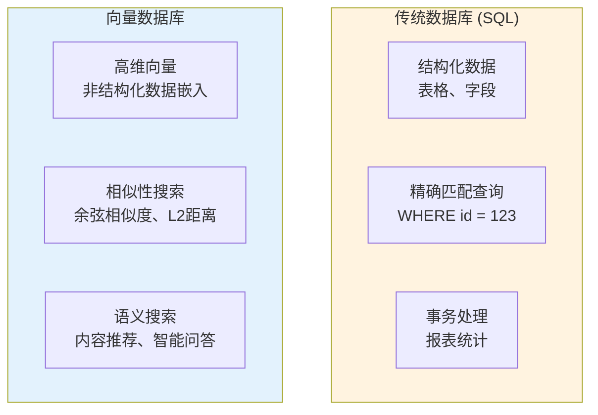

| 维度 | 传统数据库 | 向量数据库 |
|:---:|:---:|:---:|
| **数据类型** | 结构化（表格、字段） | 高维向量（非结构化数据的嵌入） |
| **查询方式** | 精确匹配（`=`、`<`、`>`） | 相似性搜索（余弦、L2 距离） |
| **应用场景** | 事务处理、报表统计 | 语义搜索、内容推荐、智能问答 |

---

## 八、数据导入向量数据库的流程

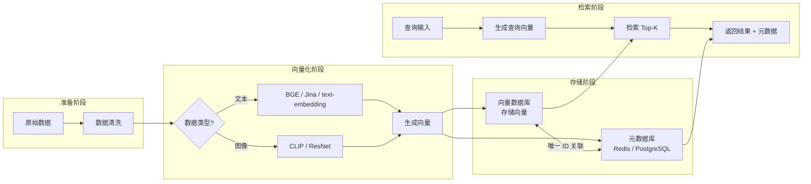

### 架构设计要点

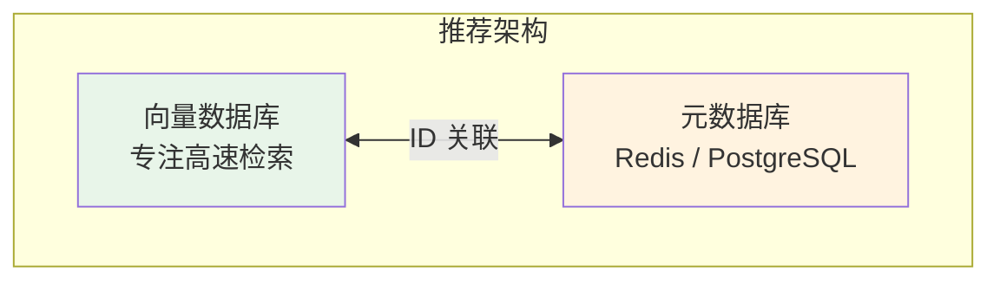

> [!TIP]
> **架构建议**：向量数据库专注**高速检索**，元数据管理交由专业数据库，实现**解耦与高效协同**。

---

## 九、总结

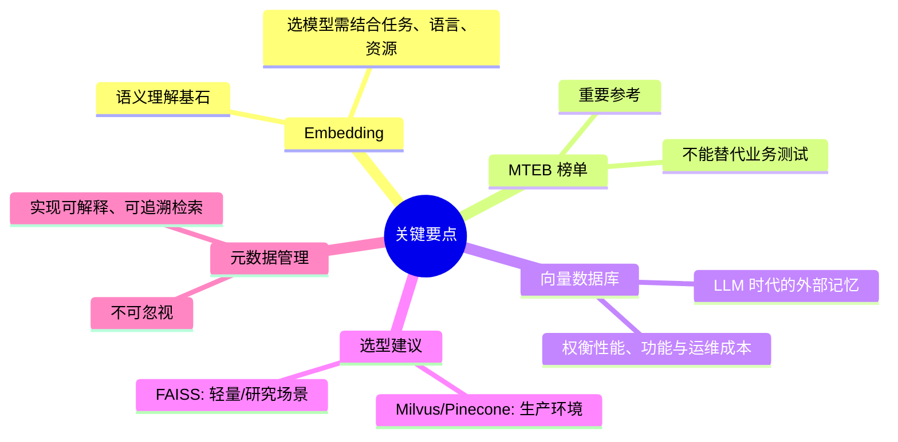

| 核心观点 | 说明 |
|:---:|:---|
| 🎯 **Embedding 是基石** | 选择合适模型需结合任务、语言、资源 |
| 📊 **MTEB 是参考** | 重要但不能替代业务测试 |
| 🧠 **向量数据库是外部记忆** | 选型需权衡性能、功能与运维成本 |
| ⚙️ **选型建议** | FAISS 适合轻量/研究，Milvus/Pinecone 适合生产 |
| 📋 **元数据不可忽视** | 是实现可解释、可追溯检索的关键 |

---

> 📅 **最后更新**：2026-02-08
