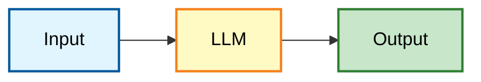

# AI 开源生态平台

## 🤗 HuggingFace

> AI 界的 **GitHub** + **App Store**

- **定位**：AI 工程师找模型和数据的地方，托管了全球主流的开源模型和数据集
- **热门模型**：[Llama](https://huggingface.co/meta-llama)、[BERT](https://huggingface.co/bert-base-uncased)、[Stable Diffusion](https://huggingface.co/stabilityai) 等
- **模型库**：[huggingface.co/models](https://huggingface.co/models)
- **特色**：提供了很多现成的 Pipeline，开箱即用

### HuggingFace 核心组件

| 组件 | 描述 |
|------|------|
| **Transformers 库** | 统一的 Python 接口，可以用几乎相同的代码加载 BERT、GPT 等模型 |
| **Model Hub** | 模型仓库，存放权重文件（`.bin` / `.safetensors`）和配置文件（`config.json`） |
| **Datasets 库** | 数据燃料库，一键下载维基百科、医疗问答、电商评论等海量数据集，并处理成模型可读格式 |

---

## 🔮 ModelScope（魔搭社区）

> 国内的 HuggingFace 替代版

- **背景**：阿里巴巴开源社区
- **定位**：托管了大量的开源模型和数据集
- **模型库**：[modelscope.cn/models](https://www.modelscope.cn/models)
- **优势**：模型更新快，适合国内网络环境使用

---

## 🔧 深度学习框架对比

| 框架 | 开发者 | 适用场景 |
|------|--------|----------|
| **TensorFlow** | Google | 生产环境部署，工业级应用 |
| **PyTorch** | Meta (Facebook) | 研究实验，快速原型开发 |

---

## 🧠 Transformers 的三大流派

| 架构 | 代表模型 | 核心能力 | 比喻 | 典型应用 |
|------|----------|----------|------|----------|
| **Encoder-Only** | BERT | 擅长理解和分析 | 📖 阅读理解满分的学生 | 文本分类、实体识别、搜索匹配 |
| **Decoder-Only** | GPT、Llama、Qwen | 擅长生成 | ✍️ 话唠小说家 | 聊天机器人、代码生成、创意写作 |
| **Encoder-Decoder** | T5、BART | 擅长转换 | 🌐 翻译官 | 机器翻译、文本摘要 |

### 流派详解

<details>
<summary><b>1️⃣ Encoder-Only（理解派）</b></summary>

- **工作方式**：你给它一篇文章，它能告诉你文章的情感是正面的还是负面的，或者提取出文章里的人名
- **代表**：BERT
- **应用**：文本分类、实体识别、搜索匹配

</details>

<details>
<summary><b>2️⃣ Decoder-Only（生成派）</b></summary>

- **工作方式**：你给它一个开头，它会根据概率不断猜下一个字是什么
- **代表**：GPT 系列、Llama、Qwen
- **应用**：聊天机器人、代码生成、创意写作

</details>

<details>
<summary><b>3️⃣ Encoder-Decoder（转换派）</b></summary>

- **工作方式**：听懂一句（Encode），然后重组成另一种语言说出来（Decode）
- **代表**：T5、BART
- **应用**：机器翻译、文本摘要

</details>

---

## 📚 常用模型速查表

### NLP（自然语言处理）领域

#### 基础理解类（Encoder-Only）

| 模型 | 特点 |
|------|------|
| **BERT / RoBERTa** | 文本分类、命名实体识别（NER）的首选经典 |
| **DistilBERT** | BERT 的轻量化版本，推理速度更快，适合端侧应用 |

#### 生成类（Decoder-Only / 大语言模型）

| 模型 | 特点 |
|------|------|
| **Llama 系列** (Meta) | 国外主流的开源大模型，适合对话、逻辑推理 |
| **Qwen 系列** (阿里) | 中文能力极强，开源社区的热门选择 |
| **DeepSeek 系列** | 极具性价比的国产模型，常用于生成和思考任务 |
| **GPT-2** | 虽然较老，但因其轻量，常作为教学文本生成的入门案例 |

#### 翻译与摘要（Encoder-Decoder）

| 模型 | 特点 |
|------|------|
| **T5 / FLAN-T5** | 能够将所有 NLP 任务转换为"文本到文本"的格式 |
| **BART** | 擅长文本纠错和长文档摘要 |

### CV（计算机视觉）与多模态领域

| 模型 | 特点 |
|------|------|
| **ViT** (Vision Transformer) | 图像分类的标杆 |
| **Stable Diffusion** | 目前很火的开源图像生成模型 |
| **CLIP** (OpenAI) | 连接文本与图像，常用于以图搜图或零样本分类 |

---

## 📦 HuggingFace 数据集

| 数据集 | 用途 |
|--------|------|
| **SQuAD** | 阅读理解任务的基准数据集 |

---

## ✂️ Tokenizer（分词器）

> Tokenization（分词）是 NLP 的入口

大模型不认识汉字，只认识数字。**Tokenizer** 负责：

```
文字 → 切成小块(Token) → 翻译成数字ID
```

**示例：**
```
"我爱编程" → ["我", "爱", "编程"] → [1234, 5678, 9012]
```

---

## ⚡ Pipeline 是什么？

> 一个全自动的黑盒，把文本扔进去，自动完成所有繁琐步骤


| 步骤 | 名称 | 作用 |
|------|------|------|
| 1️⃣ | **预处理** (Tokenizer) | 把文本变成数字 |
| 2️⃣ | **模型推理** (Model) | 模型进行计算，输出分数（Logits） |
| 3️⃣ | **后处理** (Post-processing) | 把分数变成人类能看懂的标签（如 `"Positive", 99%`） |

---

## 🛠️ 环境配置与工具

### GPU 云平台推荐

| 平台 | 特点 | 链接 |
|------|------|------|
| **AutoDL** | 国内主流 GPU 租用平台 | [autodl.com](https://www.autodl.com/) |
| **Google Colab** | 免费 GPU 资源，适合学习 | [colab.google](https://colab.research.google.com/) |
| **天池平台** | 阿里云数据竞赛平台 | [tianchi.com](https://tianchi.aliyun.com/) |

### 硬件配置建议

| 项目 | 推荐配置 |
|------|----------|
| **GPU 显卡** | 核数 > 1000 |
| **CPU 核数** | 8 核 |
| **显存要求** | Qwen2.5-7B 需要 RTX 4090 (24G)，计算公式：7B × 3 = 21G < 24G |

> **💡 提示**：GPU 推理速度比 CPU 快 20 倍以上，优先使用 API 接口

### AutoDL 使用说明

- **系统环境**：CentOS，可直接运行 `.py` 文件
- **存储空间**：`autodl-tmp` 目录（D 盘，免费送 50G）
- **推荐配置**：30G 存储空间

### 开发工具推荐

| 工具 | 特点 |
|------|------|
| **Claude Code** | 速度快，代码生成能力强 |
| **Cursor** | 靠谱的 AI 编程助手 |

---

## 🔄 框架对比：HuggingFace vs LangChain

### 核心定位

| 框架 | 定位 | 核心功能 |
|------|------|----------|
| **HuggingFace** | 面向模型使用的框架 | 模型加载、使用、微调（纯粹使用大模型本身） |
| **LangChain** | 面向 Agent 开发的框架 | LLM + Tool + MCP + Memory + Prompt Template |

> **类比**：HuggingFace 有点像在线的 MLOps

### 功能特点

**HuggingFace**
- 是一个社区，托管了大量可下载的模型
- 是一个库，帮助运行下载后的模型
- 偏向 LLM 底层，基于 Transformers
- 可以做微调、模型训练，适合业务定制

**LangChain**
- 封装了 LLM 和 Agent 所需的工具
- 帮助更方便地开发 Agent 应用
- 可以使用 Qwen 作为 LLM

### 结合使用

```
LangChain（Agent 主干）
    ↓ 加载
HuggingFace（下载/微调好的模型）
```

---

## 🧪 模型微调 FAQ

### Q：什么时候需要微调？

**场景 1：训练语料与目标语料不一致**

| 模型 | 原始语料 | 判断结果 | 目标环境 | 期望结果 |
|------|----------|----------|----------|----------|
| BERT | 公开互联网语料 | "恭喜你中奖了" → 好的 | 邮件处理 | "恭喜你中奖了" → 不好（垃圾邮件） |

**场景 2：风格转换**
- BERT 比较工整的话术 → 训练更调皮的风格
- 金融智能客服 → 准备金融领域的大量语料

**数据量需求**：1000 - 100 万条，取决于任务难度和多样性

---

### Q：全参数微调 vs 高效微调（PEFT）

| 微调方式 | 参数量 | 示例（Qwen2.5-7B） |
|----------|--------|-------------------|
| **全参数微调** | 所有参数都可变化 | 70 亿参数全部训练 |
| **高效微调（PEFT）** | 仅训练部分参数 | 约 1%，即 0.7 亿参数 |

> **工具推荐**：HuggingFace 的 PEFT 库

---

### Q：模型训练的四个步骤

```python
# 训练循环
Step 1: Forward      # 前向传播
Step 2: Backward     # 反向传播
Step 3: Optimizer.step()  # 优化器更新参数
Step 4: Zero_grad()  # 梯度清零
```

---

### Q：超参数如何调优？

| 超参数 | 推荐范围 | 说明 |
|--------|----------|------|
| `num_train_epochs` | 3-6 轮 | 如果再多，可能会记住答案（过拟合） |
| `learning_rate` | 1e-5 到 1e-2 | 常用 2e-5 |

**学习率（Learning Rate）含义**：
```
当前输出 = 1
实际参考答案 = 100
学习率 = 0.1  # 控制每次调整的步长
```

---

### Q：模型参数量与数据量的关系

| 参数量 | 所需数据量 |
|--------|-----------|
| 100 | 100 |
| 1000 | 10000 |

> 参数越大，需要的数据量越大

---

### Q：基座模型如何选择？

| 模型类型 | 代表模型 | 特点 |
|----------|----------|------|
| **大模型** | Qwen | 能力强，参数量大，GPU 要求高 |
| **中文模型** | bert-base-chinese | 适合中文任务 |
| **领域模型** | roberta-base-finetuned-dianping-chinese | 点评数据集微调 |

**加载方式**：HuggingFace、DashScope

**微调后保存**：`output_dir="./spam-bert-finetuned"`

---

## 🔍 技术细节 FAQ

### Q：Pipeline 是把 PyTorch 封装了一层吗？

是的，Pipeline 自动完成三个步骤：

```python
# Pipeline 内部流程
tokenizer = AutoTokenizer.from_pretrained(checkpoint)

# Step 1: 分词 => ids
input_ids = tokenizer(text)

# Step 2: 推理 => input ids 放到 model 中进行计算
outputs = model(input_ids)

# Step 3: 后处理 => 转换为可读结果
```

---

### Q：预处理分词就是向量化吗？

不完全是，分词是第一步：

```
原始文本 → Tokenization → Input IDs → 向量化 → Embeddings
```

---

### Q：什么是 Tensor（张量）？

GPU 上的数据结构，用于多维数组的计算

```
NLP：文本（自然语言处理）
CV：视觉（Computer Vision）

Model 结构：
input → hidden layer1 → ... → output
```

---

### Q：Task 可选的任务是模型提供的吗？

是的，例如 `sentiment-analysis` 是预训练好的任务

---

### Q：可以在 HuggingFace 基础数据集上添加自己的数据集吗？

可以，支持自定义数据集训练

---

## 🚀 RAG vs 模型微调

### 增强方式对比



| 方式 | 增强位置 | 作用 |
|------|----------|------|
| **RAG** | Input 端 | 提供 Prompt 补充，注入外部知识 |
| **模型微调** | LLM 本身 | 加强模型内部能力 |

### 实际应用

**Qwen 开源模型**：公开数据训练  
**Qwen 金融版本**：100 万专业数据 + 100 万公开数据

---

## 📊 数据工程 FAQ

### Q：真实项目与示例代码的区别？

**核心差异：数据源占 80%**

| 环节 | 占比 | 说明 |
|------|------|------|
| **数据源质量** | 80% | 配置高质量训练集，筛选多样性数据 |
| **模型选择** | 20% | Qwen 金融版本等 |

---

### Q：如何筛选高质量数据？

| 方式 | 占比 |
|------|------|
| **人工筛选** | 20% |
| **机器筛选** | 80% |

**案例**：Llama2 → Llama3 的过程
- Llama2 帮你筛选数据：100TB → 45TB

---

## 🌐 国内替代方案

### Q：不连接外网，可以使用 ModelScope 吗？

可以，操作方式基本一致

**相关资源**：
- [天池竞赛平台](https://tianchi.aliyun.com/competition/entrance/532449/team)

---

### Q：Claude Code 是否能更换为国内模型？

可以，推荐：
- **GLM 4.7**
- **MiniMax**

---

## 🏗️ Agent 项目结构

### Q：Agent 项目有没有项目结构范式？

**推荐框架**：
- `langchain` / `langgraph`
- `qwen-agent`
- `llamaindex`

**核心组件**：
- LLM 接口
- Prompt Template
- Memory
- Index
- Tool

---

## 📈 AI 数据分析

### Q：AI 做数据分析有哪些可行的落地方案？

推荐平台：[tianchi.com](https://tianchi.aliyun.com/)（天池数据竞赛）

