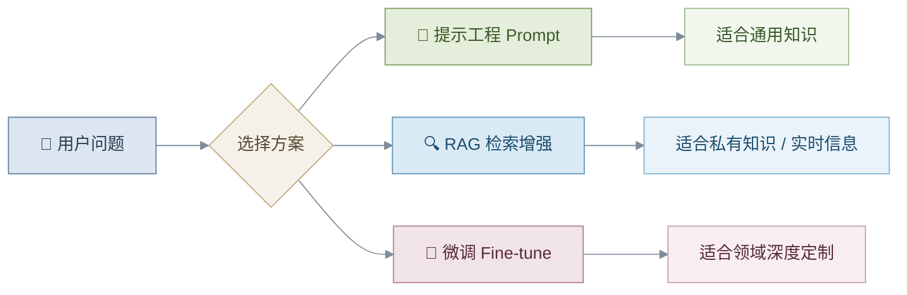
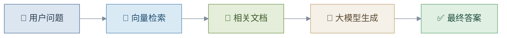
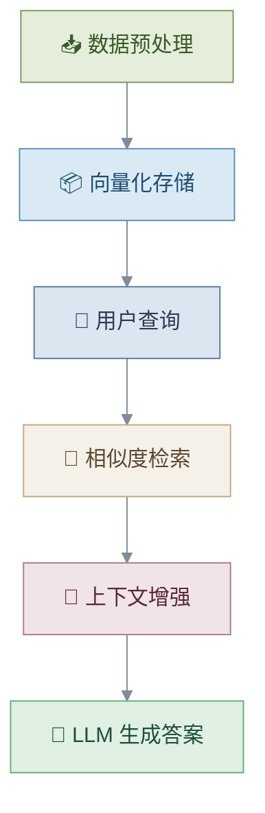
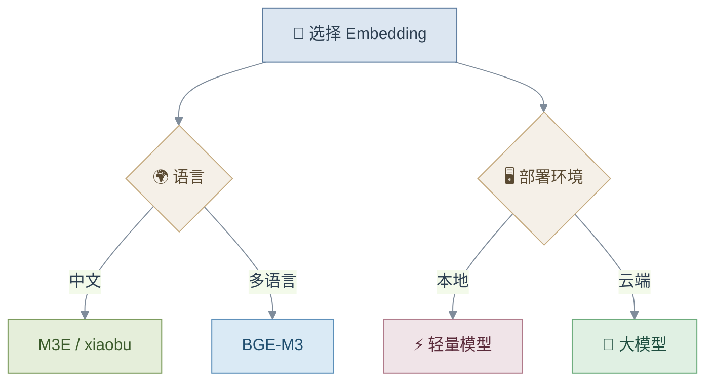
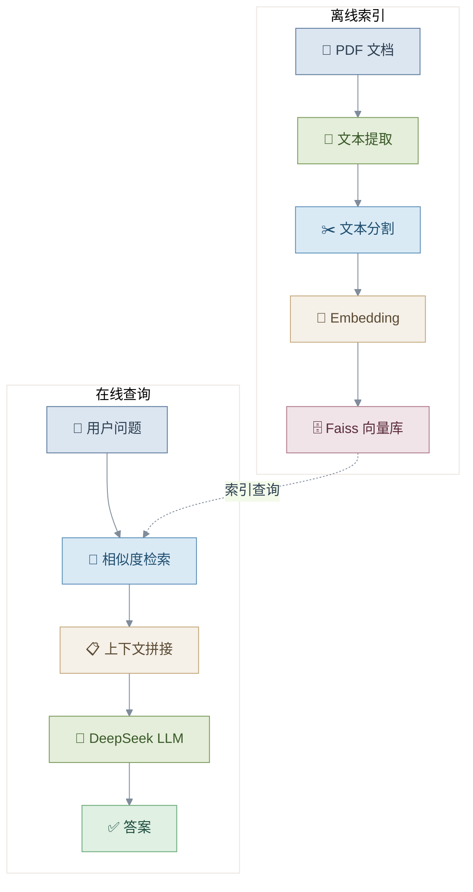
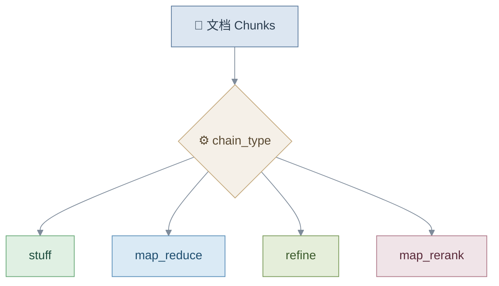
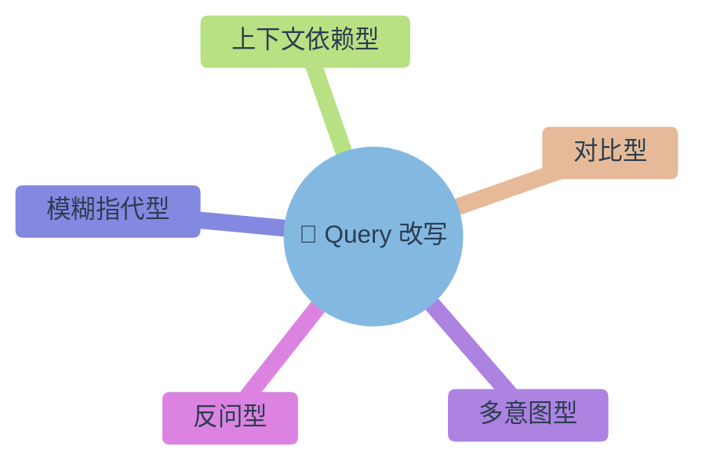
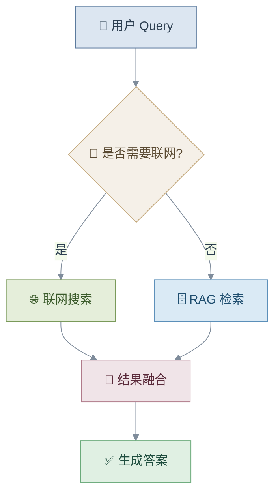
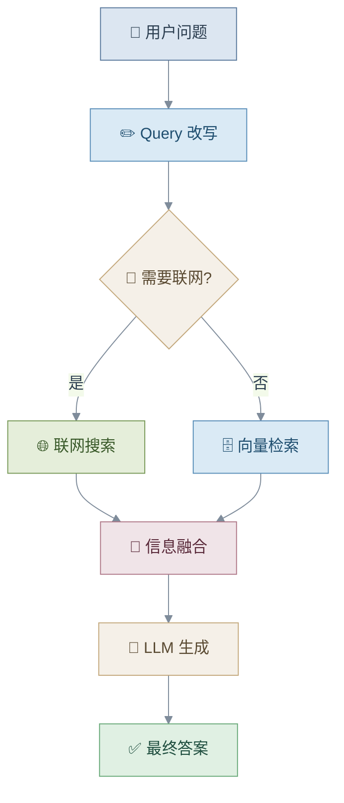

# 📘 RAG 技术与应用 — 学习笔记

---

## 一、RAG 在大模型应用中的定位

### 1. 大模型应用三种模式



### 使用场景对比

| 方法 | 适用场景 | 优点 | 缺点 |
|:---:|:---:|:---:|:---:|
| **Prompt 工程** | 通用问答 | 快速、简单 | 易产生幻觉 |
| **RAG** | 私有知识库 | 可更新、可溯源 | 架构复杂 |
| **微调** | 垂直领域 | 精度高 | 成本高 |

---

## 二、什么是 RAG？

**RAG = Retrieval-Augmented Generation（检索增强生成）**

> 💡 核心思想：**先检索 → 再生成**



### RAG 的优势

| | 优势 | 说明 |
|:---:|:---|:---|
| ✅ | 解决知识时效性问题 | 知识库随时可更新 |
| ✅ | 减少模型幻觉 | 基于真实文档生成 |
| ✅ | 提升专业领域质量 | 注入领域知识 |
| ✅ | 支持私有数据部署 | 数据不出域 |

---

## 三、RAG 核心流程

### 整体流程



---

### Step 1：数据预处理

| 步骤 | 说明 |
|:---:|:---|
| 1️⃣ | 文档收集 |
| 2️⃣ | 文档分块（Chunking） |
| 3️⃣ | Embedding 向量化 |
| 4️⃣ | 存入向量数据库 |

**关键参数：**

```python
chunk_size    = 1000   # 每块大小
chunk_overlap = 200    # 块间重叠
```

> 👉 **平衡原则**：块太大 → 检索不精确；块太小 → 语义不完整

---

### Step 2：检索阶段


---

### Step 3：生成阶段

| 步骤 | 说明 |
|:---:|:---|
| 1️⃣ | 拼接检索到的上下文 |
| 2️⃣ | 连同用户问题一起送入 LLM |
| 3️⃣ | 输出答案 + 来源引用 |

---

## 四、Embedding 模型选择

### 分类对比

| 类型 | 模型 | 特点 | 适用场景 |
|:---:|:---|:---|:---|
| 🌐 通用 | BGE-M3 | 多语言 + 长文本 | 企业级 RAG |
| 🌐 通用 | text-embedding-3-large | 英文强 | 国际应用 |
| ⚡ 轻量 | Jina-v2-small | 实时推理 | 边缘设备 |
| 🇨🇳 中文 | M3E-base | 本地部署友好 | 中文检索 |
| 🇨🇳 中文 | xiaobu-embedding | 中文语义强 | 中文 NLP |
| 🎯 指令型 | gte-Qwen2 | 复杂任务 | 智能问答 |

---

### Embedding 选择策略



---

## 五、案例：DeepSeek + Faiss 本地知识库

### 架构图



### 技术栈

| 模块 | 技术 | 说明 |
|:---:|:---:|:---|
| 文档解析 | `PyPDF2` | PDF 文本提取 |
| 分割 | `LangChain Splitter` | 文本分块 |
| 向量库 | `Faiss` | 高效近邻检索 |
| Embedding | `DashScope` | 阿里云向量化 |
| LLM | `DeepSeek` | 大语言模型 |
| 编排 | `LangChain` | 流程编排框架 |

---

## 六、LangChain 问答链类型



| 类型 | 特点 | 适合场景 | 推荐 |
|:---:|:---|:---|:---:|
| **stuff** | 所有文档一次性输入 LLM | 小文档、短上下文 | ⭐ |
| **map_reduce** | 每段独立处理后汇总 | 大文档、并行处理 | |
| **refine** | 逐段迭代优化答案 | 长上下文、高精度 | |
| **map_rerank** | 每段评分后取最佳 | 精准筛选 | |

> 👉 推荐优先使用 **stuff**，简单高效，适合大多数场景

---

## 七、Query 改写（提升检索质量）

### 为什么需要改写？

| 用户 Query | 知识库文档 |
|:---:|:---:|
| 口语化 | 书面化 |
| 模糊表达 | 结构化描述 |
| 上下文依赖 | 独立完整 |

> 👉 Query 改写就是 **"翻译器"**，弥合用户表达与知识库之间的语义鸿沟

---

### Query 改写类型



---

### 改写流程


---

## 八、Query + 联网搜索

### 什么时候需要联网？

| 类型 | 示例 | 原因 |
|:---:|:---|:---|
| ⏰ 时效性 | "今天开放吗？" | 信息实时变化 |
| 💰 价格 | "门票多少钱？" | 价格可能调整 |
| 🌤️ 天气 | "明天天气怎样？" | 实时气象数据 |
| 📊 实时状态 | "现在人多吗？" | 动态变化信息 |

---

### 联网判断流程



---

### 联网搜索系统设计


---

## 九、RAG vs 无限上下文 LLM

> 即使 LLM 支持超长上下文，RAG **仍然有意义**：

| | 优势 | 说明 |
|:---:|:---|:---|
| 🚀 | **更高效率** | 只检索相关片段，无需处理全文 |
| 💰 | **更低成本** | 减少 Token 消耗 |
| 🔄 | **实时更新** | 知识库独立更新，无需重训模型 |
| 🔍 | **可解释性** | 答案可追溯到原始文档 |
| 🔒 | **数据隐私** | 敏感数据不必上传至模型服务商 |

---

## 十、完整 RAG 系统架构



---

## 十一、实战 Checklist

### 搭建自己的 RAG 系统

- [ ] 📥 收集知识库文档
- [ ] 📄 PDF 文本提取
- [ ] ✂️ 文本分块（Chunking）
- [ ] 📐 选择 Embedding 模型
- [ ] 🗄️ 构建向量库
- [ ] 🤖 接入 LLM
- [ ] ✏️ Query 改写
- [ ] 🌐 联网搜索判断
- [ ] 🔗 结果溯源

---

## 总结

> 💡 RAG 的本质：**让 LLM 会查资料再回答**

### 核心能力

| 能力 | 说明 |
|:---:|:---|
| 🔍 高质量检索 | 精准匹配相关知识 |
| 🧠 Query 理解 | 意图识别与改写 |
| 📝 上下文增强 | 注入外部知识 |
| 🏗️ 可扩展架构 | 灵活接入多种数据源 |

### 未来趋势

> 👉 **RAG + Agent + Web Search = 智能知识系统**